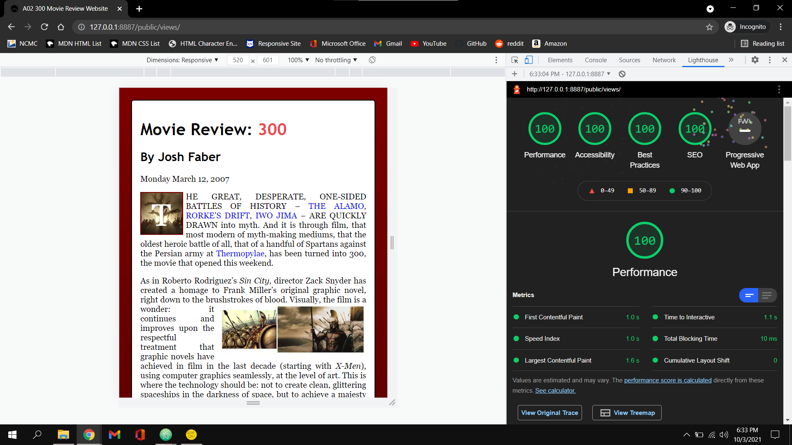
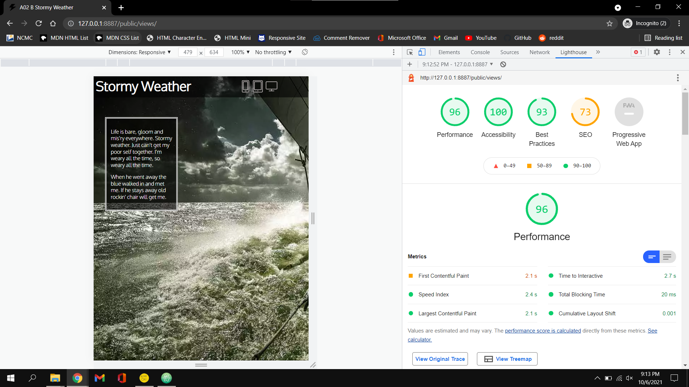

Very happy with how my 300 review website turned out. I feel like that is as close to perfect as it can get. My Stormy Weather website... well I just ran out of time with it. I think it looks pretty close to the example but I didn't have time to make the buttons interactive or finish making a print stylesheet for it. I work 50 hours a week and I spent over 60 hours in the last two weeks obsessively pouring over Interneting is Hard and I googled so many things and I just didn't have time to make both websites perfect. I was only able to get through 7 chapters of Interneting is Hard because there was just not enough time in two weeks to go through that entire tutorial and make two websites. I spend all of my free time doing homework for this class as it is and I just didn't have time for everything. I did the best that I could with the b site, but hopefully the quality of the first one makes up for it. I spent a ton of time with this assignment and I hope that shows.

All of the code in the public folders is minified with all of the comments removed and all of the code in the src folders are written out normally with comments explaining my process and linking to websites where I learned the techniques I used.

